# Hanzi Animator

Chinese character handwriting animation generator with realistic stroke-by-stroke rendering.

[中文文档](./README_CN.md)

## Demo

| 一 | 永 | 中 | 爱 | 把 |
|:---:|:---:|:---:|:---:|:---:|
|  |  |  |  |  |

| 龙 | 国 | 心 | 人 | 天 |
|:---:|:---:|:---:|:---:|:---:|
|  |  |  |  |  |

> Open SVG files in browser to see animation effect.

## Features

- **Vector SVG Animation** - Infinite scaling, tiny file size (8-40KB per character)
- **Realistic Stroke Order** - Follows official stroke data from makemeahanzi
- **Smooth Animation** - CSS-based stroke drawing effect with proper timing
- **Customizable** - Support custom TTF fonts and animation parameters
- **9000+ Characters** - Covers most common Chinese characters

## Known Issues

Due to the **misalignment between the skeleton stroke data and the TTF font**, the animation may have the following issues:

- **Position offset**: The stroke mask may not perfectly align with the font glyph
- **Coverage gaps**: Some parts of the font may not be fully revealed by the stroke mask
- **Visual artifacts**: Overlapping or missing areas in complex characters

**Root cause**: The makemeahanzi skeleton uses a fixed 1024x1024 coordinate system, while TTF fonts have variable bounding boxes based on each character's shape. The current implementation centers the font using its own bounding box, which doesn't match the skeleton's expected positioning.

**Potential solutions** (contributions welcome):
- Use a TTF font that matches the makemeahanzi skeleton style
- Implement dynamic coordinate transformation
- Generate skeleton data from the TTF font directly

## Installation

```bash
pip install -r requirements.txt
```

Requirements:
- Python 3.10+
- Pillow
- numpy

## Quick Start

```python
from src import HandwriteGenerator

# Initialize generator
generator = HandwriteGenerator()

# Generate vector SVG animation
generator.generate_vector("永")

# Generate multiple characters
for char in "中国人":
    generator.generate_vector(char)
```

Output files are saved to `output/` directory.

## Animation Modes

### Vector SVG (Recommended)

```python
generator.generate_vector("永")
```

- File format: SVG
- Size: 8-40 KB per character
- Scalable: Yes
- Animation: CSS stroke-dashoffset

### GIF Animation

```python
generator.generate("永")
```

- File format: GIF
- Size: 50-200 KB per character
- Scalable: No (raster)
- Animation: Frame-based

## Configuration

```python
from src import HandwriteGenerator, AnimationConfig

config = AnimationConfig(
    workspace_size=1024,       # Processing resolution
    output_size=(64, 64),      # Output resolution (GIF only)
    fps=20,                    # Frame rate (GIF only)
)

generator = HandwriteGenerator(cfg=config)
```

## Project Structure

```
hanzi-animator/
├── src/
│   ├── data/
│   │   ├── graphics_loader.py    # Stroke data loader
│   │   └── font_manager.py       # TTF font manager
│   ├── animation/
│   │   ├── vector_svg_encoder.py # Vector SVG encoder
│   │   ├── svg_encoder.py        # SVG encoder
│   │   └── gif_encoder.py        # GIF encoder
│   ├── utils/
│   │   └── config.py             # Configuration
│   └── generator.py              # Main entry point
├── data/
│   ├── makemeahanzi/             # Stroke data (graphics.txt)
│   └── fonts/                    # TTF fonts
├── output/                       # Generated animations
├── examples/
│   └── demo.py                   # Usage examples
├── pyproject.toml
├── requirements.txt
├── README.md
└── README_CN.md
```

## Data Sources

- **Stroke Data**: [makemeahanzi](https://github.com/skishore/makemeahanzi) - 9000+ characters with SVG stroke paths
- **Font**: Custom TTF handwriting font (place in `data/fonts/`)

## API Reference

### HandwriteGenerator

| Method | Description |
|--------|-------------|
| `generate_vector(char)` | Generate vector SVG animation |
| `generate(char)` | Generate GIF animation |
| `generate_batch(chars)` | Batch generate multiple characters |
| `has_character(char)` | Check if character is supported |

### AnimationConfig

| Parameter | Default | Description |
|-----------|---------|-------------|
| `workspace_size` | 1024 | Processing resolution |
| `output_size` | (64, 64) | Output resolution |
| `fps` | 20 | Frame rate |
| `font_path` | auto | Path to TTF font |

## Technical Details

### Vector SVG Animation

The vector SVG animation uses CSS `stroke-dashoffset` to create a "drawing" effect:

1. **Mask Layer**: SVG paths from makemeahanzi stroke data
2. **Content Layer**: TTF font rendered as base64 PNG
3. **Animation**: CSS keyframes animate `stroke-dashoffset` from full length to 0

Animation timing:
- Drawing phase: ~30% of loop
- Hold phase: ~45% of loop
- Reset phase: ~25% of loop

## Contributing

Contributions are welcome! Areas that need improvement:

1. **Coordinate alignment** - Better matching between skeleton and TTF font
2. **Font compatibility** - Support for fonts that match makemeahanzi style
3. **Animation smoothing** - More natural stroke drawing effect
4. **Performance** - Optimize for batch generation

## License

MIT License - see [LICENSE](./LICENSE) file.

## Acknowledgments

- [makemeahanzi](https://github.com/skishore/makemeahanzi) for stroke data
- All contributors and users
